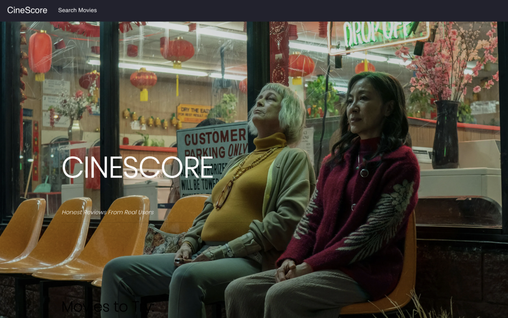

# CIS450 Final Project: CineScore

Alex Park, Chelsea Pan, Gabby Gu, Sebin Lee

____________

To run CineScore on your computer:
  1. Download cis450-final-project.zip
  2. Npm install into both client and server folders
  3. Npm install bluebird into the server folder
  3. Npm start both client and server
  4. View the web page locally at localhost:3000 in your browser
  
____________

# About the Project

Using databases from Letterboxd and MovieLens, we have created a movie recommendation website for users. CineScore includes a home page, displaying recent and highly rated movies, along with users who have rated a high number of movies. It also provides movie overview and user profile pages. Cinescore implements a fully functinoal search page where users can filter through movies using keywords and tags.

  
